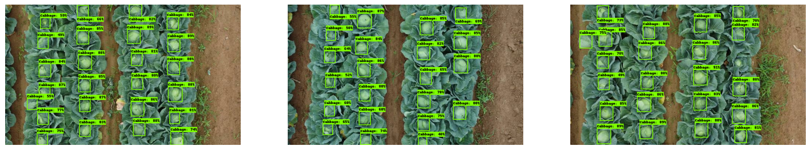

# cabbageCV

CNN related method to estivate cabbage size

current reslt is ap50=0.87 for `retinanet_resnetfpn_coco` model

* dataset are put in [cabbage2023](https://drive.google.com/drive/folders/1DDnzfKEph2a8wSruEkUR9-HfcbIX9sq2)

## TODO
* Try to apply other models e.g. `centernet`, `yolo`
* split large picture to smaller. (perprocessing.)

## ref
* [CenterNet](https://github.com/xingyizhou/CenterNet)
* [TensorFlow Object Detection API](https://github.com/tensorflow/models/tree/master/research/object_detection)

